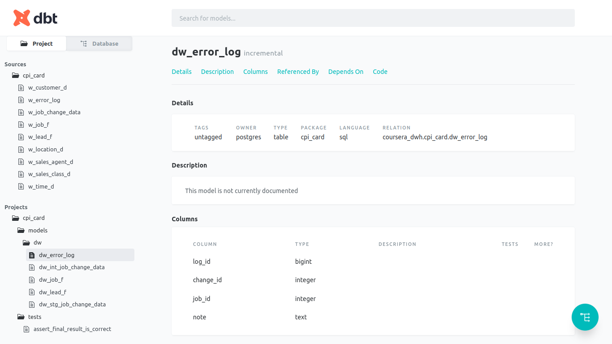
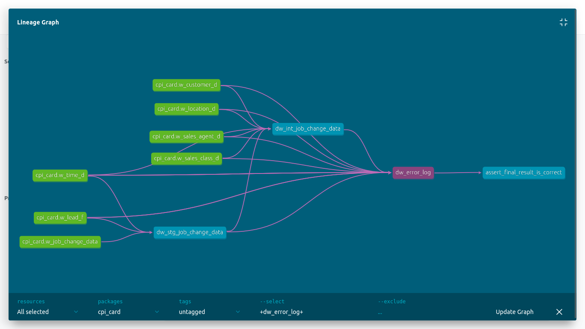
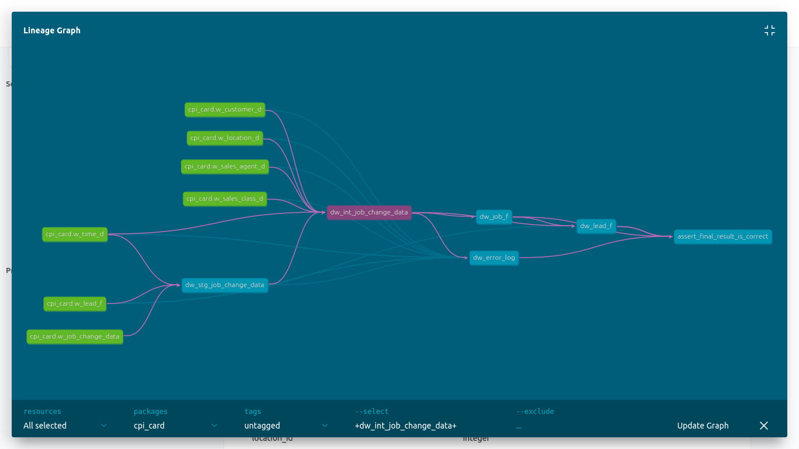
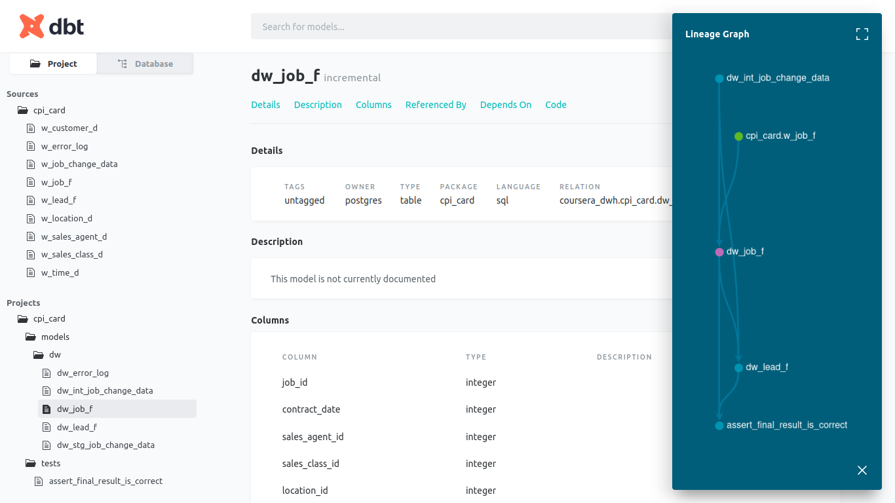
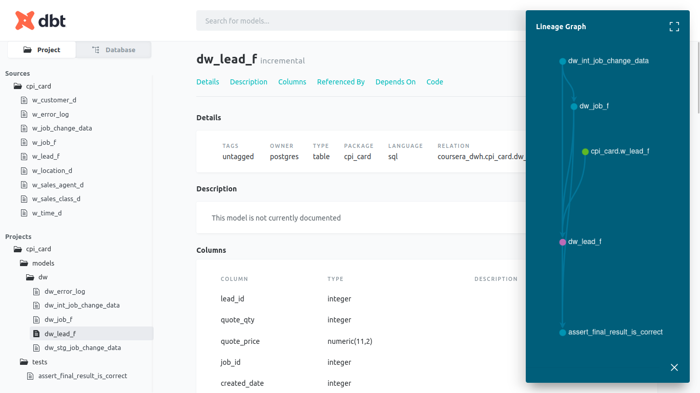
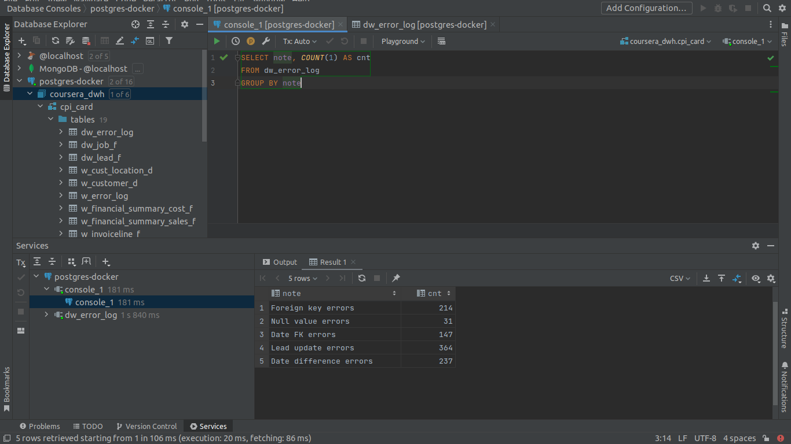
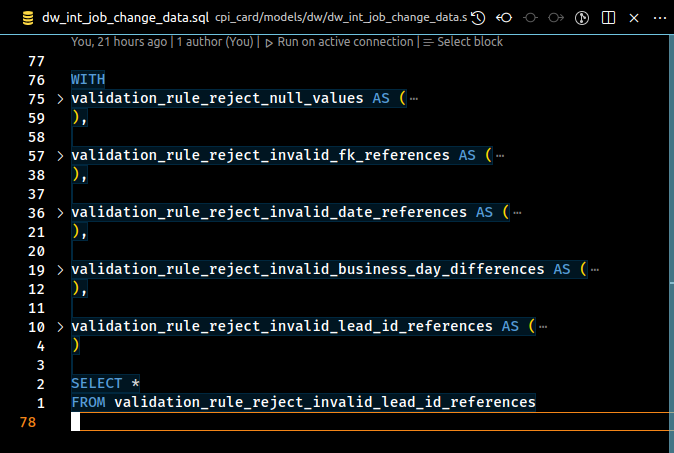

# Some Pictures

### dbt docs for `error_log`

### dbt lineage for `error_log`

### dbt lineage for `intermediate table`

### dbt lineage for `job facts`

### dbt lineage for `lead facts`

### Total errors by group

### Reproduce initial load

### Reproduce incremental load

### Validation rule implementation

